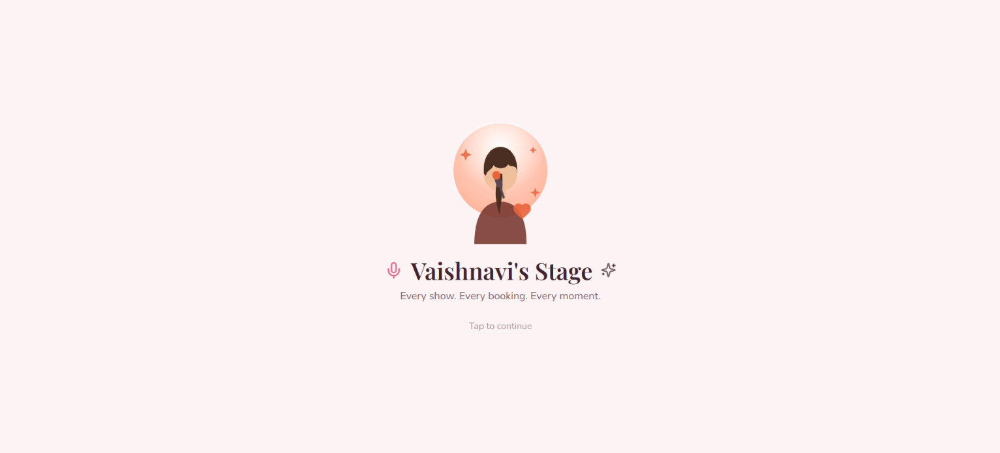
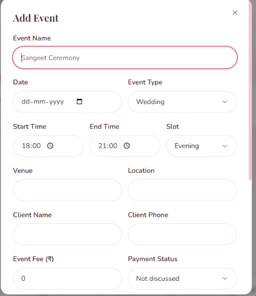
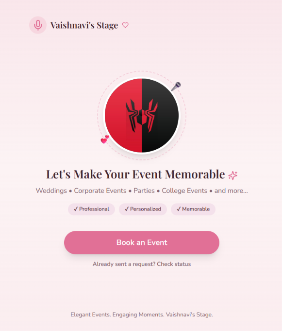

# Vaishnavi's Stage 🎤✨

**Every show. Every booking. Every moment.**

A personal event-management and client-booking assistant built for Vaishnavi, an event anchor/host. It manages her shows, keeps her schedule realistic (accounting for travel, prep, and buffer time), lets clients check her availability and request bookings without needing her private calendar, and gives her reusable WhatsApp-ready message templates — all for ₹0/month on free tiers.


> **Before you do anything else, read [`VAISHNAVIS_STAGE_SETUP_STEPS.md`](./VAISHNAVIS_STAGE_SETUP_STEPS.md).** It walks through every step from "empty folder" to "live on the internet."
>
> Already deployed and want it to feel snappier? See [`PRODUCTION_SMOOTHNESS_GUIDE.md`](./PRODUCTION_SMOOTHNESS_GUIDE.md) — what was slowing things down, what was fixed, and how to verify it in your own deployment.

## Screenshots

| Splash screen | Add event (dashboard) | Public booking page |
|---|---|---|
|  |  |  |

## What's inside

- **Private dashboard** (`/`, `/calendar`, `/templates`, `/bookings`, `/settings`) — no login screen. Since Vaishnavi is the only person who will ever use this app, the dashboard is simply always "her": the first request auto-creates a single owner record in MongoDB and every page/API route uses it. Don't deploy this dashboard somewhere the public can reach it without some other access control (see the security note below).
- **Public booking page** (`/book`) — no login required, by design. Shows only safe availability (morning/evening: available / limited / booked) and a booking request form. Never exposes client names, fees, venues, or private notes.
- **Smart scheduling engine** (`lib/scheduling.ts`) — checks travel time + preparation time + safety buffer between events and warns (or blocks) when a new event doesn't leave enough room.
- **5 themes** (Rose, Lavender, Sky, Cream, Midnight) as CSS variables, persisted in `localStorage` and MongoDB, with a smooth crossfade and `prefers-reduced-motion` support.
- **Message template manager** with `{{placeholders}}`, WhatsApp share (`wa.me` links, free), copy-to-clipboard, and default templates you can edit or reset.
- **.ics calendar export** per event, plus an optional "Add to Google Calendar" link — no paid calendar API needed.
- **Voice assistant** ("Ask Vaishnavi's Stage") using free browser speech recognition plus a free, offline, rule-based understanding engine — no account, API key, or paid tier of any kind required. It understands everyday phrasing (dates, times, day-parts, "confirmed" vs "tentative") and saves events/shifts directly. Optionally, you may connect your own Anthropic API key for looser free-form conversation on top of this — that's an opt-in extra, never required.
- Since Vaishnavi is the app's only user, there's no signup or login screen anywhere in the app — every request is treated as hers automatically.
- **PWA** — installable on a phone's home screen, mobile-first throughout.

## Tech stack

Next.js (App Router) · React · TypeScript · Tailwind CSS · shadcn/ui-style primitives (Radix) · Lucide icons · Framer Motion · MongoDB Atlas + Mongoose · Zod · React Hook Form · `ics` for calendar export · Vercel Hobby plan.

There is no login system — this is a single-owner app, built specifically for Vaishnavi to use alone.

No Supabase, Firebase, Prisma, paid WhatsApp Business API, paid SMS, paid email, paid maps, or paid domain are used anywhere.

## Quick start

```
npm install
cp .env.example .env.local   # then fill in your own values
npm run dev
```

Full instructions (MongoDB Atlas setup, Google OAuth, Vercel deploy, testing checklist, free-tier limits) are in **`VAISHNAVIS_STAGE_SETUP_STEPS.md`**.

## Project structure

```
app/
  (dashboard)/             Private dashboard (no login -- always the single owner)
    calendar/ templates/ bookings/ settings/
  book/                    Public availability + booking request flow
  api/                     Route handlers: events, bookings, availability, templates, settings, ai
  globals.css              Theme system (CSS variables per theme)
  layout.tsx / manifest.ts / icon.png

components/                UI components, incl. components/ui/ primitives
lib/                       mongodb, auth, scheduling, validations, calendar (.ics), whatsapp, availability, utils
models/                    Mongoose schemas: User, Event, Client, MessageTemplate, BookingRequest, Reminder, Settings
hooks/use-theme.ts
public/icons/              PWA icons
public/og-icon.png         Social link preview image (Open Graph)
screenshots/                README preview images
```

## ⚠️ Security note: no login

The dashboard has no authentication at all — anyone with the URL can open `/`, `/calendar`, `/bookings`, `/settings`, etc. and see client names, fees, and private notes. That's fine as long as you keep the deployment private (e.g. don't share the URL, or put it behind Vercel's built-in "Password Protection" / a private link on a paid plan, or your host's equivalent). If you ever want other people to be unable to reach the dashboard even with the link, you'll need to add some access control back in front of it.

## A note on this build

Every file in this project is real, working source code, not a mockup. `npm install`, `tsc --noEmit`, `next lint`, and `next build` have all been run and pass cleanly against this exact codebase.